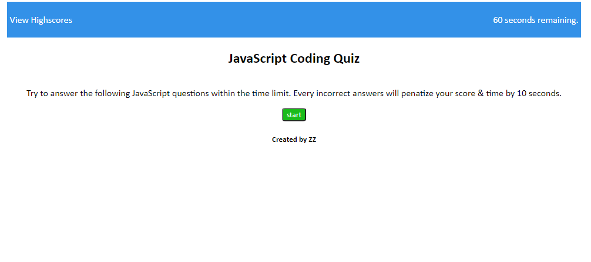
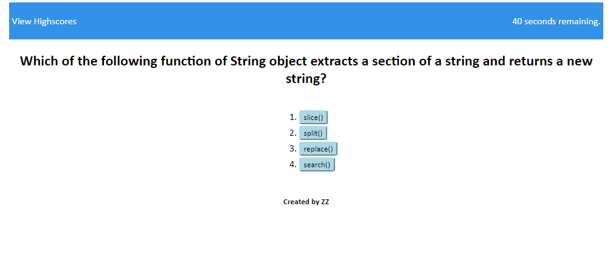
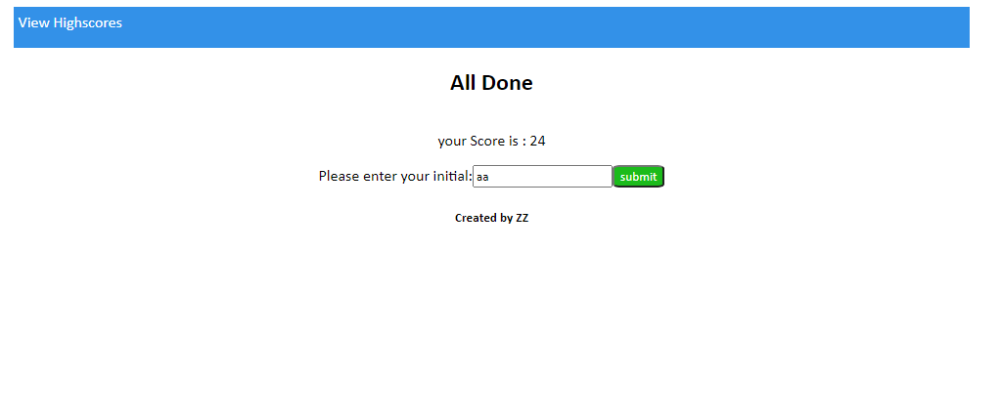
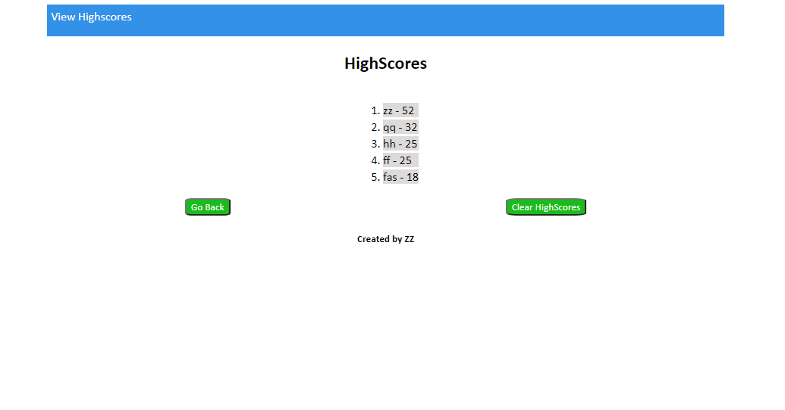

# JavaScript Coding Quiz

## Description

## Rules

## Credits

## License
This project is using the [MIT](./LICENSE) license.

## Screenshots
* Quiz start

* Question page

* Submit Highscores

* Highscores

## Link
[JavaScript Coding Quiz github repository](https://github.com/realzzkevin/javascript-Code-Quiz-ZZ)

[JavaScript Coding Quiz](https://realzzkevin.github.io/javascript-Code-Quiz-ZZ/)
